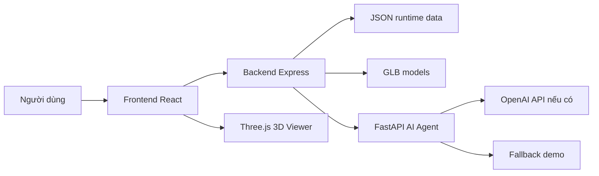
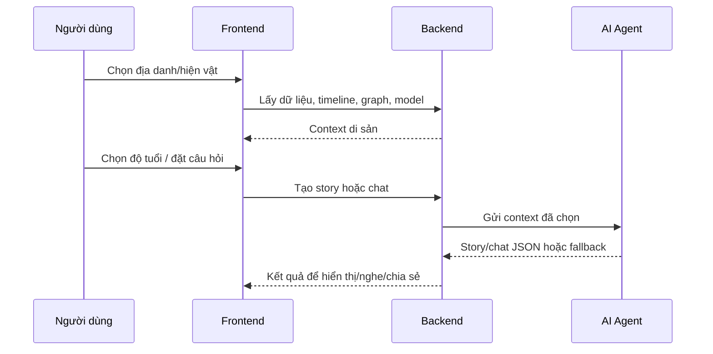

# Di Sản Việt Nam

Di Sản Việt Nam là MVP khám phá di sản Việt Nam bằng bản đồ tương tác, mô hình 3D, AI storytelling, voice và chatbot hướng dẫn viên. Mục tiêu không phải làm thêm một kho thông tin lịch sử, mà tạo một cách để người Việt nhìn, hiểu, nghe, hỏi và chia sẻ câu chuyện di sản theo đúng bối cảnh của mình.

## Tổng Quan

| Thông tin | Chi tiết |
| --- | --- |
| Tên dự án | Di Sản Việt Nam |
| Lĩnh vực | EdTech · Heritage Tech · AI |
| Người dùng chính | Học sinh, sinh viên, gia đình, người yêu lịch sử, du khách nội địa |
| Phạm vi MVP | Một luồng demo có bản đồ, địa danh, hiện vật, model 3D, story AI, voice, chatbot và chia sẻ |
| Ngôn ngữ hiện tại | Tiếng Việt |

## Vấn Đề

Di sản Việt Nam rất giàu, nhưng trải nghiệm tiếp cận còn phân mảnh:

- Khoảng cách địa lý khiến học sinh và gia đình ngoài các trung tâm lớn khó tiếp cận bảo tàng/di tích quan trọng.
- Thông tin di sản nằm rải rác trên nhiều nguồn, khó biết đâu là mạch kể dễ hiểu.
- Bảng thuyết minh tại di tích thường ngắn, còn hướng dẫn viên không phải lúc nào cũng sẵn có.
- Người trẻ quen trải nghiệm trực quan, tương tác, chia sẻ nhanh; cách trình bày lịch sử thuần chữ dễ bị bỏ qua.

## Giải Pháp

Di Sản Việt Nam gom trải nghiệm thành ba lớp:

```text
[Tiếp cận]   -> Bản đồ Việt Nam + model 3D để nhìn thấy di sản từ xa
[Hiểu biết]  -> AI kể chuyện theo độ tuổi + timeline + story graph + voice/chatbot
[Gắn kết]    -> Link chia sẻ và hướng phát triển cộng đồng ký ức địa phương
```

Sản phẩm không thay thế chuyến đi thực tế. Nó bổ trợ trước chuyến đi, tạo chiều sâu khi tham quan, và giúp người dùng lưu/chia sẻ câu chuyện sau khi trở về.

## Track 3: Tác Động Đến Việt Nam

Di Sản Việt Nam tập trung vào các bối cảnh rất Việt Nam:

- Học sinh đi ngoại khóa theo chương trình phổ thông nhưng cần câu chuyện để nhớ, không chỉ mốc năm.
- Gia đình đi di tích với nhiều thế hệ, mỗi người cần một cách giải thích khác nhau.
- Bảo tàng và di tích địa phương có tư liệu nhưng thiếu nguồn lực làm trải nghiệm số hấp dẫn.
- Người trẻ quen xem trên điện thoại, hỏi nhanh, nghe nhanh và gửi link trong nhóm lớp/gia đình.

Nếu bỏ yếu tố Việt Nam ra, sản phẩm mất lý do tồn tại; đây không phải một AI travel app gắn thêm tên quốc gia.

## Demo Flow

1. Mở trang chủ và vào bản đồ Việt Nam.
2. Chọn một địa danh.
3. Xem chi tiết địa danh, timeline và bảo vật liên quan.
4. Mở mô hình 3D để quan sát hiện vật/không gian, xoay, zoom và xem chú thích.
5. Chọn độ tuổi: trẻ em, thiếu niên hoặc người lớn.
6. Tạo câu chuyện AI.
7. Xem timeline, story graph, nghe voice và chia sẻ.
8. Mở hiện vật và hỏi chatbot hướng dẫn viên.

## Tính Năng Trong MVP

- Bản đồ Việt Nam và các điểm di sản.
- Trang địa danh và hiện vật.
- Bảo tàng 3D dùng GLB/DRACO, có xoay/zoom, auto-rotate, reset camera và chú thích theo điểm quan sát.
- AI kể chuyện theo độ tuổi.
- Timeline lịch sử và story graph kết nối địa điểm, sự kiện, nhân vật, hiện vật và ý tưởng.
- Chatbot hướng dẫn viên theo context hiện vật.
- Voice playback.
- Chia sẻ câu chuyện bằng link.
- Fallback demo khi không có API key hoặc LLM lỗi.

## Kiến Trúc





- Frontend: Vite, React, TypeScript, TailwindCSS, Three.js.
- Backend: ExpressJS, TypeScript.
- Agent: FastAPI, Python.
- Infra: Docker Compose.

Backend đọc dữ liệu địa danh, hiện vật, timeline, graph và danh sách model từ file runtime. Agent tạo câu chuyện/chat dựa trên context, có fallback demo khi không có API key hoặc LLM lỗi.

## Cấu Trúc Repo

```text
.
├── frontend/          # React app, bản đồ, story UI, 3D model viewer
├── backend/           # Express API, content/story/share/model routes
├── agent/             # FastAPI AI agent, prompt, fallback, voice/chat/story
├── infra/dev/         # Docker Compose cho môi trường dev
├── README.md          # Hướng dẫn repo và demo
└── TAILIEU.md         # Phân tích Track 3: tác động đến Việt Nam
```

## Dữ Liệu Và Model 3D

- Dữ liệu nội dung được đọc từ `backend/src/data` khi chạy runtime.
- Model 3D đặt trong `frontend/public/models` dưới dạng `.glb`.
- Bộ viewer dùng Three.js, `GLTFLoader`, `DRACOLoader`, OrbitControls và preset camera/chú thích cho từng model.
- Các model demo hiện có gồm Ấn Sắc mệnh chi bảo, Lăng vua Tự Đức - khu Hòa Khiêm, Chùa Một Cột và Xe tăng 843.

## Chạy Local

```bash
docker compose --env-file .env -f infra/dev/docker-compose.yml up --build
```

Endpoints mặc định:

- Frontend: http://localhost:5173
- Backend health: http://localhost:3000/api/health
- Agent health: http://localhost:8000/health

Chạy riêng từng service:

```bash
cd backend
npm install
npm run dev
```

```bash
cd frontend
npm install
npm run dev
```

```bash
cd agent
python -m venv .venv
.venv\Scripts\activate
pip install -e .
uvicorn app.main:app --reload --port 8000
```

## Biến Môi Trường

Xem `.env.example` để biết các biến cần thiết. Agent dùng `OPENAI_API_KEY` khi có. Nếu không có key hoặc LLM lỗi, hệ thống trả về nội dung fallback để demo không bị dừng luồng.

## Điều Không Nói Quá

MVP này chưa phải kho dữ liệu di sản quốc gia và chưa thay thế nhà sử học, bảo tàng hay hướng dẫn viên thật. Dữ liệu hiện là bộ mẫu nhỏ để chứng minh luồng trải nghiệm, chưa đại diện đầy đủ cho di sản/vùng miền Việt Nam.

Câu chuyện AI trong demo chỉ dựa trên context mẫu, chưa phải tư liệu chính thống. Bản production cần nguồn trích dẫn, kiểm duyệt nội dung và thử nghiệm thật với lớp học, gia đình hoặc một điểm di tích cụ thể.

## Đường Phát Triển

- Mở rộng kho địa danh/hiện vật có nguồn kiểm chứng.
- Bổ sung RAG và trích dẫn nguồn rõ ràng cho AI thuyết minh.
- Hỗ trợ tiếng Anh và các ngôn ngữ du lịch phổ biến khi có dữ liệu kiểm định.
- Mở rộng tham quan 360/VR cho các di tích phù hợp.
- Cho phép cộng đồng đóng góp ảnh, ký ức địa phương và câu chuyện có kiểm duyệt.
- Bổ sung bộ lọc theo tỉnh thành, loại hình di tích, thời kỳ lịch sử và chủ đề.
- Đo tác động bằng số lớp học dùng thử, số câu chuyện chia sẻ, thời gian tương tác và phản hồi hiểu biết sau trải nghiệm.

## Tài Liệu Liên Quan

- `TAILIEU.md`: phân tích sâu về Track 3 và tác động đến Việt Nam.
