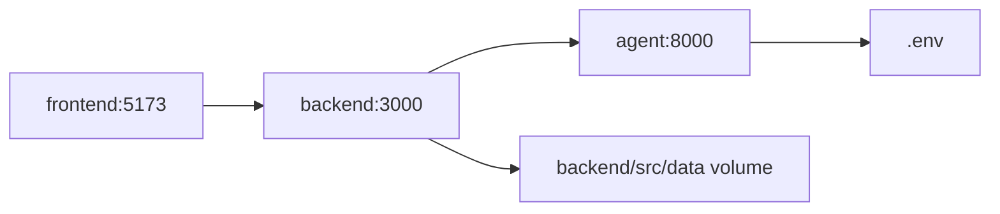

# Infrastructure

## Môi Trường Dev

MVP chạy bằng Docker Compose tại `infra/dev/docker-compose.yml`.



## Services

| Service | Port | Vai trò |
| --- | --- | --- |
| frontend | `5173` | Vite React app |
| backend | `3000` | Express API |
| agent | `8000` | FastAPI AI agent |

## Environment Variables

| Biến | Service | Mục đích |
| --- | --- | --- |
| `FRONTEND_PORT` | compose | Override port frontend |
| `BACKEND_PORT` | compose | Override port backend |
| `AGENT_PORT` | compose | Override port agent |
| `VITE_API_BASE_URL` | frontend | Backend URL frontend sẽ gọi |
| `AGENT_BASE_URL` | backend | URL agent backend sẽ gọi |
| `APP_PUBLIC_URL` | backend | URL public dùng khi tạo share link |
| `OPENAI_API_KEY` | agent | Gọi OpenAI API nếu có |
| `LLM_MODEL` | agent | Model LLM, mặc định trong compose |

## Run

```bash
docker compose --env-file .env -f infra/dev/docker-compose.yml up --build
```

Endpoints:

- Frontend: http://localhost:5173
- Backend health: http://localhost:3000/api/health
- Agent health: http://localhost:8000/health

## Local Service Commands

```bash
cd frontend
npm install
npm run dev
```

```bash
cd backend
npm install
npm run dev
```

```bash
cd agent
python -m venv .venv
.venv\Scripts\activate
pip install -e .
uvicorn app.main:app --reload --port 8000
```

## Data And Storage

- MVP dùng file JSON trong `backend/src/data`.
- Docker Compose mount `backend/src/data` vào backend container để dữ liệu runtime có thể đọc/ghi.
- Model 3D nằm trong `frontend/public/models`.
- Chưa có database production trong scope hiện tại.

## Deployment Notes

- Frontend có thể build static bằng Vite.
- Backend cần Node runtime.
- Agent cần Python 3.11+ và env chứa API key nếu dùng LLM thật.
- Production nên tách storage dữ liệu khỏi container và thêm kiểm soát nguồn nội dung.

## Verification

```bash
cd frontend
npm run build
```

```bash
cd backend
npm run build
```

```bash
cd agent
uvicorn app.main:app --port 8000
```
