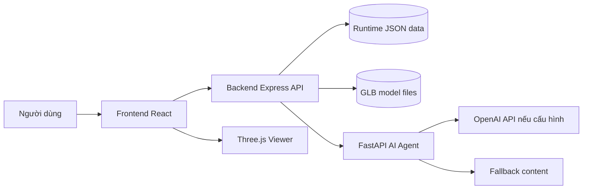
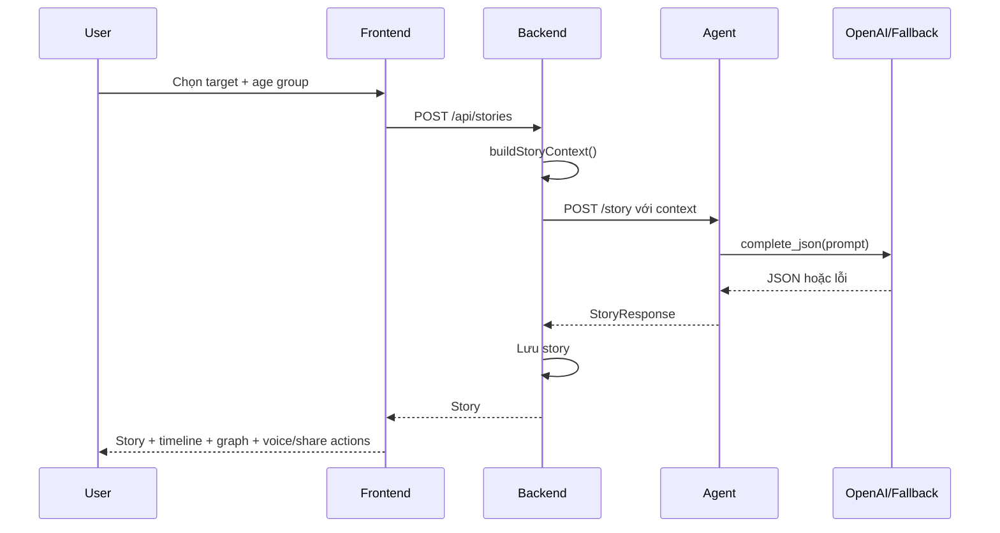
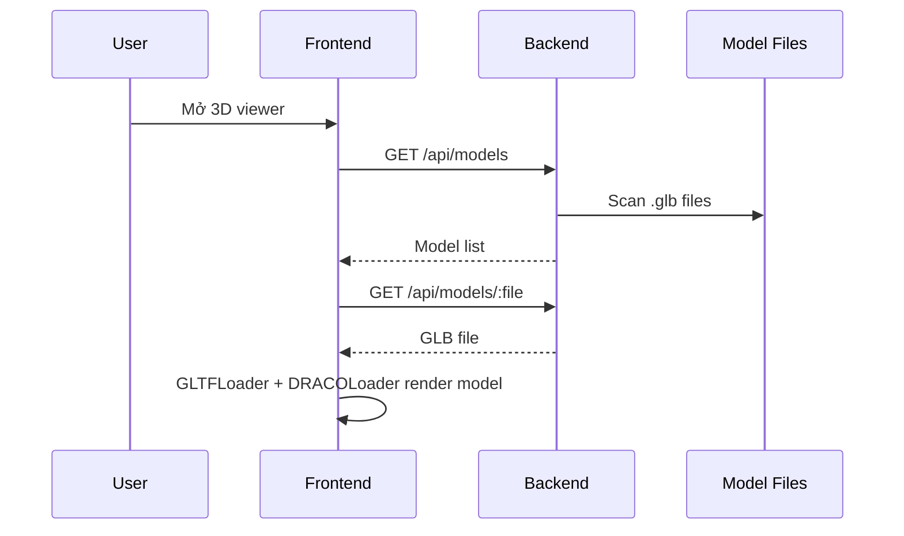
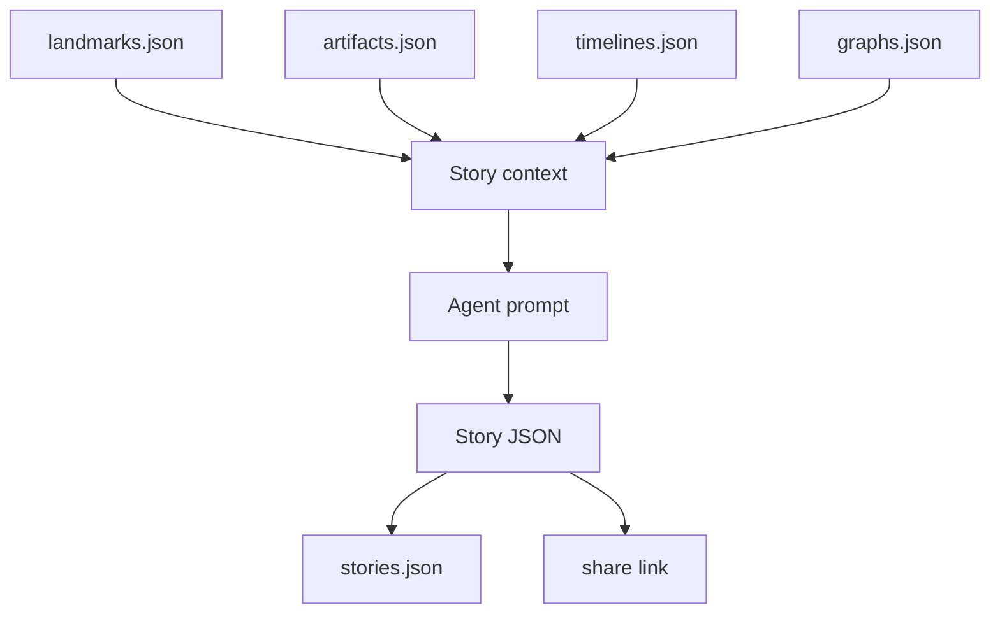

# System Architecture

## Tổng Quan

Di Sản Việt Nam gồm ba service chính:

- Frontend React: giao diện, bản đồ, story UI, 3D viewer.
- Backend Express: API trung tâm, đọc dữ liệu runtime, quản lý story/share/model route.
- FastAPI Agent: sinh story, chat và voice dựa trên context.

## Component Responsibilities

| Component | Trách nhiệm |
| --- | --- |
| Frontend | Render UI, điều hướng, gọi API, hiển thị map/story/3D/chat/voice |
| Backend | Validate request, đọc dữ liệu, dựng context, gọi agent, lưu story/share JSON |
| Agent | Prompting, gọi LLM nếu có, parse JSON response, fallback khi lỗi |
| Runtime JSON | Dữ liệu địa danh, hiện vật, timeline, graph, story/share |
| GLB Models | Tài sản 3D phục vụ viewer |

## Story Generation Flow

## 3D Model Flow

## Data Flow

## Trust Boundaries

- Browser input is untrusted; backend validates target type, target id and age group.
- Agent output is untrusted until parsed into schema.
- AI content is demo content unless backed by verified sources.
- GLB filenames are normalized with `path.basename` before serving.

## Failure Handling

- Missing target: backend returns `404`.
- Invalid story request: backend returns `400`.
- Agent/LLM failure: agent returns fallback story/chat.
- 3D load failure: frontend shows model error state.
